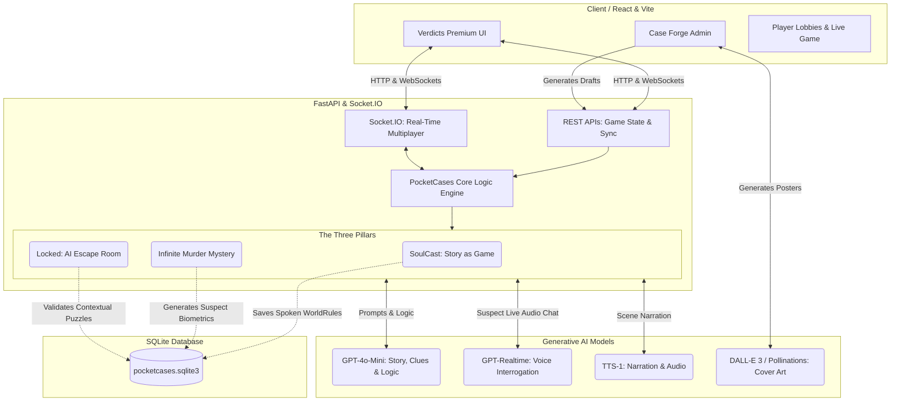

# PocketCases 🔍🎙️

PocketCases is an AI-native interactive entertainment platform inspired by **Pocket FM**. It features real-time multiplayer story rooms where listeners become detectives, search for clues, interrogate suspects via AI, and make decisions that shape the narrative. 

This repository contains the complete frontend (React/Vite) and backend (FastAPI/Socket.io/SQLite) codebase.

---

## 🏛️ Architecture & Tech Stack

PocketCases is split into a modern decoupled architecture designed to run efficiently either locally or inside a **Databricks Apps** serverless environment.

### 1. Frontend (React + Vite)
- **Framework**: React 18 with Vite as the build tool.
- **Styling**: Modern, premium dark-mode UI built using Vanilla CSS with high-performance CSS animations and glassmorphism.
- **Realtime**: `socket.io-client` for multiplayer room synchronization.

### 2. Backend (FastAPI + Socket.IO)
- **Framework**: FastAPI (Python 3.10+) serving the REST endpoints.
- **Realtime**: `python-socketio` (ASGI) handling websocket lobbies.
- **Database**: SQLite (`pocketcases.sqlite3`) storing room states and curated cases.
- **Validation**: Pydantic v2 schemas for all inputs and state transitions.

### 3. AI Services & Models Used
We utilize advanced OpenAI models for text-to-speech, real-time multiplayer audio chat, story generation, and art production:
- **Text & Case Generation**: `gpt-4.1-mini` (or `gpt-4o-mini`) – Used for generating complex case outlines, clues, motives, suspect biographies, and character responses during interrogations.
- **Realtime Voice Chat (Interrogation)**: `gpt-realtime` (OpenAI Realtime API / `gpt-4o-realtime-preview`) – Enables low-latency, conversational voice interrogations directly with the suspects.
- **Text-to-Speech (TTS) Narration**: `gpt-4o-mini-tts` (or `tts-1`) – Narrates story prefaces and choices aloud to provide a high-fidelity audiobook experience.
- **Cover Art Generation**: `dall-e-3` – Generates cinematic movie-style covers for approved cases. If no key is set or the API fails, it seamlessly falls back to **Pollinations.ai** to ensure artwork is always rendered.

---

## 🌟 Core Features & AI Agents

PocketCases leverages autonomous AI agents to build dynamic, infinite gameplay that adapts to players in real-time.

### 1. The 3 Game Modes
- **SoulCast (Story as Game)**: An interactive audiobook experience where listeners don't just listen—they make critical decisions that alter the narrative path. AI agents dynamically branch the story based on player choices, ensuring no two playthroughs are the same.
- **Infinite Murder Mystery**: Players act as detectives in a fully generated crime scene. Every clue, motive, and suspect is logically woven together by an AI mastermind agent (`gpt-4o-mini`). The AI ensures the mystery remains solvable but challenging, dynamically generating supporting and red-herring clues.
- **Locked (AI Escape Room)**: A contextual puzzle room where players must use environmental clues to escape. The AI acts as the "Dungeon Master", validating if a player's creative solution (e.g., "I use the broken glass to cut the rope") makes logical sense within the physical rules of the room.

### 2. Admin Capabilities: The "Case Forge"
Our Admin Studio empowers creators to build entire worlds in seconds. By simply typing a one-sentence theme (e.g., *"A poisoned wine glass at a royal palace"*), the backend autonomous agent:
- Drafts a complete, logically sound narrative structure.
- Generates unique suspects with deep psychological motives and hidden secrets.
- Uses **DALL-E 3** to automatically generate a cinematic, movie-quality cover art poster.
Once the Admin clicks "Publish", the game is instantly synced to the SQLite database and pushed to all active players via WebSockets.

### 3. Voice & Chat Capabilities (Real-Time Interrogation)
Instead of picking from pre-written dialogue trees, players interrogate suspects using natural language.
- **Text & Voice Chat**: Players can type or speak their questions to suspects.
- **AI Personas**: Each suspect is powered by an independent AI agent with a strict persona prompt. They know their secrets and their alibis, and will lie, deflect, or confess based on the evidence the player presents to them.
- **Voice Synthesis**: Using **TTS-1** and the **OpenAI Realtime API**, suspects respond with realistic, emotional voice audio, creating an incredibly immersive roleplay experience.
- **AI Detective Assistant**: To prevent players from endlessly scrolling back through the story to find a missed detail or doubt, players can chat with a built-in AI assistant. The AI parses the entire game history and answers their specific doubts instantly, keeping players engaged in the investigation.

---

## ⚙️ How It Works (Workflow)



1. **Admin / Case Forge**: Admins input a theme (e.g. *"A poisoned wine glass at a royal palace"*). The AI generates a fully-detailed murder mystery with suspects, biological motives, and 3 tiers of clues (critical, supporting, red herring).
2. **Dynamic Art & Publishing**: Upon approving the draft, the app automatically generates a custom cinematic cover art poster and publishes the game.
3. **Verdicts Catalog**: The published case instantly syncs and appears in the players' **Verdicts** menu.
4. **Browser Refresh Auto-Reset (Demo Mode)**: To keep the demo environment clean, refreshing your browser window triggers a request that wipes temporary published cases, leaving the default three curated cases.

---

## 🚀 How to Run Locally

### Prerequisites
- Python 3.10 or higher installed.
- Node.js (v18+) installed.

### Step 1: Setup Backend
1. Open a terminal in the project root:
   ```bash
   python -m venv venv
   # On Windows:
   .\venv\Scripts\activate
   # On macOS/Linux:
   source venv/bin/activate
   
   pip install -r requirements.txt
   ```
2. Copy the `.env.example` to `.env` and fill in your keys:
   ```env
   OPENAI_API_KEY=sk-proj-your-actual-api-key
   DATABASE_PATH=./pocketcases.sqlite3
   ```

### Step 2: Setup Frontend
1. Open a new terminal in the `frontend-react` folder:
   ```bash
   cd frontend-react
   npm install
   ```

### Step 3: Run the App
1. **Start the Python Backend**:
   ```bash
   # From root folder
   .\venv\Scripts\python.exe -m app.main
   ```
   *The backend will run on `http://127.0.0.1:8000`.*
   
2. **Start the React Frontend**:
   ```bash
   # From frontend-react folder
   npm run dev
   ```
   *The frontend will run on `http://localhost:5173`. Open this URL in your browser.*

---

## ☁️ Deploying to Databricks Apps

PocketCases is configured to build and deploy to **Databricks Apps** out of the box using the configured `app.yaml` file.

### Step 1: Build the Frontend Assets
Since the Python backend serves the static React assets in production, compile the React build locally before deploying:
```bash
cd frontend-react
npm run build
cd ..
```

### Step 2: Authenticate Databricks CLI
If you haven't already:
1. Generate an Access Token in your Databricks workspace (**User Settings -> Developer -> Access tokens**).
2. Run in your terminal:
   ```bash
   databricks configure
   ```
3. Enter your Databricks Workspace URL (e.g. `https://xxx.databricksapps.com`) and paste the generated token.

### Step 3: Deploy
Run the deployment command from the project root:
```bash
databricks apps deploy digitalagentic --source-path .
```
Databricks will automatically spin up the FastAPI service, bind it to the correct internal port, and serve your React app!

---

## 🧪 Quick Verification & Demos

- **API Documentation**: While the backend is running, access the interactive Swagger UI at:
  [http://localhost:8000/docs](http://localhost:8000/docs)
- **Health Check**: Verify the status of the server and SQLite database:
  [http://localhost:8000/api/health](http://localhost:8000/api/health)
- **Case Forge / Admin Panel**: Click the profile icon in the bottom left of the sidebar, log in with admin, and try typing a custom theme like `"Murder on the Mumbai-Pune Expressway"`. Click "Generate Draft" to watch DALL-E-3 and GPT-4o-mini work in real time.
